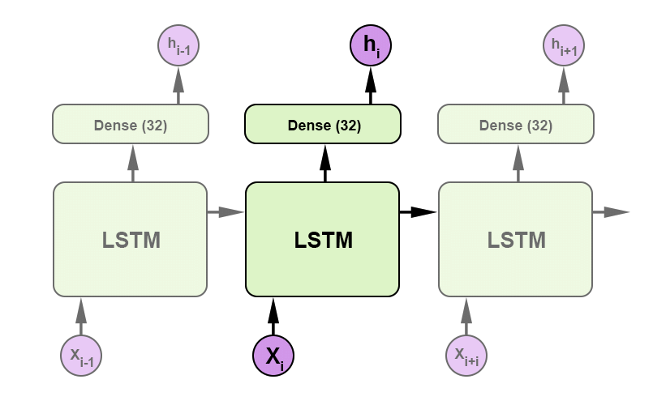
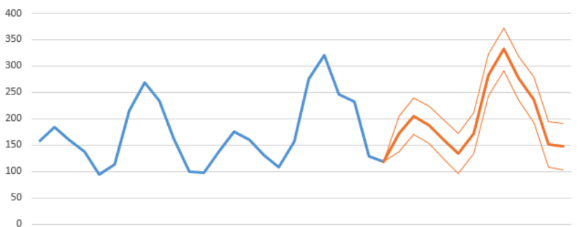
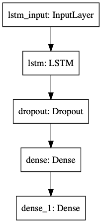
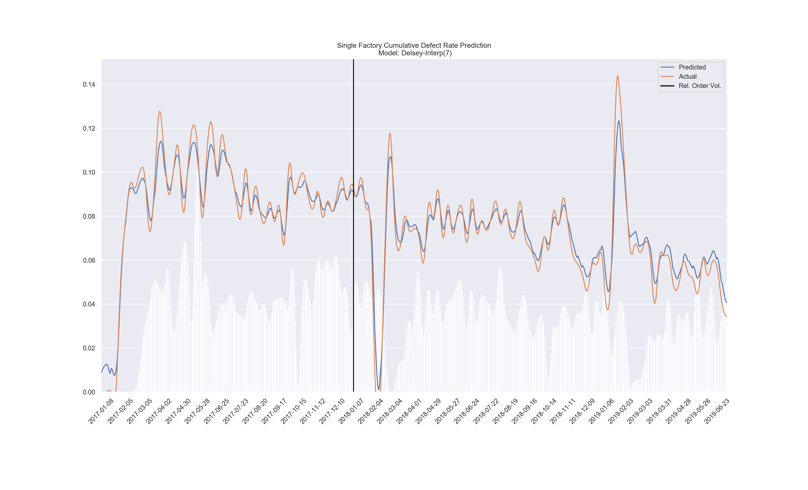

<p align="center">

<h1 align="center">Defect Net V4</h1>
<p align="center">


</p>

</p>

### Contents
- [Introduction](#intro)  
- [Technical Overview](#overview)
- [Detailed Docs](#docs)  

<a name="intro"/>

#### Before Running:

`pip3 install -r requirements.txt`


## Introduction

The defect net is a recurrent neural network that predicts next week's defect rate.
This defect rate is for a specific factory, and is calculated by a client's inspection forms coming from that factory.
Currently, the model is able to predict the defect rate for the upcoming week within ~1%. The model takes in the defect rates and total order quantities for the previous couple of weeks and makes an intelligent guess of what the defect rate could be for next week.

<a name="overview"/>

## Technical Overview

#### 1. It starts with the Long Short Term Memory Neural Network.

The LSTM architecture is remarkably powerful for sequential data, which fits the scenario of defect rates being loosely tied to the factory's historical rates.



#### 2. The model takes in a time series to make a prediction.

The 1 week predictor uses the previous three weeks of defect rates and order quantities. The dataset is expanded with simple quadratic interpolation to both provide more training data, and expose defect rate momentum to the model, which results in a far more robust model.



#### 3. Training time and model updating time is within minutes.

Given a compressed network architecture, the model is fast. This is two-fold as a smaller architecture will generalize better for this situation.

#### 4. The output is passed through a Savitzky-Golay filter.

This step is critical to aligning the model predictions. The raw output of the model is 7 numbers representing 7 days of defect rates. The first 6 do not have any real meaning as they are artifacts of the interpolation technique. The Savitzky-Golay is a signal processing technique that smooths a signal. In this case, The seventh day, representing next week's defect rate is better aligned .


<a name="docs"/>

## Docs

##### Data Cleaning

File: `data_utils.py`

Params: `--client_name`, `--no_interpolate`

Example Usage: `python3 data_utils.py`

This module connects directly to the analytics SQL database, pulls a table into a Pandas DataFrame, and processes the forms into a time series format of defect rates. The `no_interpolate` flag disables quadratic interpolation.

The first step is to select the necessary columns and drop null values.

Then, the defining step, is to pass the dataframe to a processor function to turn the data into a supervised time series dataset. Here's an example for Delsey:

```
def reduce_to_supervised_delsey(df):
    """Return a dataframe of dfr,orderqty for each week for each factory"""
    factories = df['Place'].unique()
    week_dfs = [g for n, g in df.groupby(pd.Grouper(key='Date', freq='W'))]
    factory_dict = {factory: [[0, 0] for _ in range(len(week_dfs))] for factory in factories}
    factory_insp_total_size = {factory: [0] * len(week_dfs) for factory in factories}
    weeks_index = weeks_to_index(week_dfs)
    max_poqty = {factory: 0 for factory in factories}
    for index, row in df.iterrows():
        factory = row['Place']
        poqty = int(row['TotalQuantity'])
        sample_size = int(row['TotalSampleSize'])
        dfr = float(row['DefectRate']) / 100
        num_defects = dfr * sample_size
        week = weeks_index.index(trunc_datetime(row['Date']))
        num_defects_prev = factory_dict[factory][week][0] * factory_insp_total_size[factory][week]
        factory_insp_total_size[factory][week] += sample_size
        factory_dict[factory][week][0] = (num_defects_prev + num_defects) / factory_insp_total_size[factory][week]
        factory_dict[factory][week][1] += poqty
        if factory_dict[factory][week][1] > max_poqty[factory]:
            max_poqty[factory] = factory_dict[factory][week][1]
    for factory in factory_dict:
        for week in range(len(week_dfs)):
            factory_dict[factory][week][1] /= max_poqty[factory]
    ret = pd.DataFrame(factory_dict)
    ret.index = weeks_index
    return ret
  ```

Then, using an interpolation technique, the data is expanded by 7x, and saved to CSV files, one for each input metric (e.g. 2 files for defect rate and order quantities).

#### Model Construction

File: `topo_defect_net.py`

Params: `--model_name`, `--column`

Example Usage: `python3 topo_defect_net.py --model_name="Delsey-Interp(7)"`

This step builds a Tensorflow graph and feeds the cleaned data, preprocessed into tensors, to train the graph's weights before saving the graph into a model file for later use.

We start with the `load_data(name, column=None)` function to initialize the global configuration parameters (stored in `model_configs.json`), return dataframes for the corresponding CSV files made in the data cleaning step, and process the data into tensors, both training sets and testing sets. It's important to turn the dataframe data into useable tensors for the LSTM, which need to be 3-dimensional: `[samples, timesteps, classes]`. We don't know the number of samples ahead of time necessarily, but timesteps is defined in the config (lookback of 21 for the 1 week interpolation example) and classes would be 2 given previous defect rate and order quantity as inputs. Processing this input would look like this:
```
def process_input_tensor(data):
    out = []
    for i in range(CONF.LOOKBACK, len(data[0])):
        t = []
        for j in range(CONF.LOOKBACK):
            t.append([feature[i - CONF.LOOKBACK + j] for feature in data])
        out.append(t)
    return np.array(out).reshape(-1, CONF.LOOKBACK, CONF.NUM_INPUT_CLASSES)
```
This tensor comes out something like this (defect rate, order quantity):

```
array([[[ 3.22903226e-02,  8.47229029e-04],
        [ 2.53618408e-02,  5.90526359e-04],
        [ 1.92052186e-02,  3.79047006e-04],
        ...,
        [ 2.93910412e-04,  3.60674841e-04],
        [ 1.81037085e-04,  2.08685314e-04],
        [ 8.30669474e-05,  8.84603671e-05]],

       [[ 1.92052186e-02,  3.79047006e-04],
        [ 1.38204559e-02,  2.12790971e-04],
        [ 9.20755266e-03,  9.17582522e-05],
        ...,
        [ 8.30669474e-05,  8.84603671e-05],
        [ 0.00000000e+00,  0.00000000e+00],
        [-6.81637576e-05, -5.66957872e-05]],

       ...,

       [[ 5.93283760e-02,  4.98474608e-01],
        [ 5.98185870e-02,  5.09431281e-01],
        [ 6.00204889e-02,  5.16999701e-01],
        ...,
        [ 3.52234134e-02,  2.76642253e-01],
        [ 3.47109052e-02,  2.44619602e-01],
        [ 3.44925139e-02,  2.10857989e-01]]])

```

A similar process is needed to transform the labels into a series equivalent to the expected output of the LSTM. There's only one dimension to this data so it has the form: `[samples, timesteps, 1]`, and the function looks like this:

```
def process_output_tensor(data):
    out = []
    for i in range(0, len(data) - CONF.OUTPUT_LEN + 1):
        out.append(data[i:i + CONF.OUTPUT_LEN])
    return np.array(out)
```
Which produces something like this:

```
array([[ 0.00000000e+00, -6.81637576e-05, -1.21424325e-04, ...,
        -1.79885293e-04, -1.61631504e-04, -1.01669740e-04],
       [-6.81637576e-05, -1.21424325e-04, -1.59781703e-04, ...,
        -1.61631504e-04, -1.01669740e-04,  0.00000000e+00],
       [-1.21424325e-04, -1.59781703e-04, -1.79885293e-04, ...,
        -1.01669740e-04,  0.00000000e+00,  1.43377716e-04],
       ...,
       [ 4.21977084e-02,  4.02146155e-02,  3.85256396e-02, ...,
         3.60300385e-02,  3.52234134e-02,  3.47109052e-02],
       [ 4.02146155e-02,  3.85256396e-02,  3.71307806e-02, ...,
         3.52234134e-02,  3.47109052e-02,  3.44925139e-02],
       [ 3.85256396e-02,  3.71307806e-02,  3.60300385e-02, ...,
         3.47109052e-02,  3.44925139e-02,  3.45682395e-02]])
```

The next step is build an untrained model, done here using the Keras framework, which provides a high level API for Tensorflow graphs. Using the global configuration parameters, an LSTM network is assembled and returned.

```
Model: "Topo Defect Net Delsey-Interp(7)"
_________________________________________________________________
Layer (type)                 Output Shape              Param #   
=================================================================
lstm (LSTM)                  (None, 24)                2592      
_________________________________________________________________
dropout (Dropout)            (None, 24)                0         
_________________________________________________________________
dense (Dense)                (None, 12)                300       
_________________________________________________________________
dense_1 (Dense)              (None, 7)                 91        
=================================================================
Total params: 2,983
Trainable params: 2,983
Non-trainable params: 0
```



Then, using `model.fit()`, the processed tensors are fed to the network for training, and the trained model is then serialized in `/models/`.

A metric is also printed for a single forward pass of the testing data, which will look something like:

```217/217 [==============================] - 0s 433us/sample - loss: 4.4114e-04```

The `loss: 4.4114e-04` is the testing loss, which should usually be less than 0.001.

#### During/After Training:
`tensorboard --logdir ./runs` to visualize training loss in a browser.

#### The configurations

File: `model_configs.json`

The standard layout of the configuration looks like:

```
Model name (used for versioning/saving): {
  OUTPUT_LEN: The number of timesteps to be predicted (7 for the interpolation model)
  NUM_UNITS: Width of the network, smaller is better
  NUM_HIDDEN_LAYERS: experimental feature, usually kept at 0
  DROPOUT: boolean, adds feature that randomly disables nodes in the graph during training to prevent overfitting. Works very well for this model
  DROPOUT_RATE: probability for dropout, 0.5 is a good strong value
  NUM_INPUT_CLASSES: number of features to pass as input, 2 for defect rate and order quantity
  LOOKBACK: number of previous timesteps for the model to consider, 21 to represent previous 3 weeks of data for interpolation model
  TRAINING_EPOCHS: number of passes for training, 5000 is a catch-all, usually 2500 is enough
  DATA_SPLIT_RATIO: where to split data into training and testing set. 0.75 means use first 75% of data for training
  DATA_PATHS: list of CSV files for data. First path is assumed to also be label class
  DEFAULT_COLUMN: best factory for default training/testing. Can be overwritten in load_data()
}
```

#### Making predictions and analyzing results

File: `analyze_model.py`

Params: `--model_name`, `--column`, `--plot`, `--no_interp`

Example Usage: `python3 analyze_model.py --model_name="Delsey-Interp(7)` or  
`python3 analyze_model.py --model_name="Delsey-Interp1(1) --no_interp`

This script loads a model and its data and plots the resulting prediction graph. Depending on the output length of the model, the input values are skipped over to produce a continous set of prediction values, which are then flattened and plotted against the true value. The parameter plot (partial, full) chooses plot output. The script internally uses the `interp_predict(model, xdata)` function from `topo_defect_net.py`. The output plot looks something like:



We interpret this as each point on the blue line being an informed prediction based off the previous actual defect rate data (orange line) and order quantity data (white bar chart). The vertical black line shows the data split ratio.

## On Deployment

There are a few options here for deploying this solution with scalability in mind. First and foremost, a certain quality of data need be present for the model to produce useful results. Weekly inspections at the factory are a good indicator.

Using Tensorflow, there appears to be .NET bindings such that the models can be loaded natively into an Azure function and tapped as a REST API for predictions. Otherwise, a docker instance can be made for these python scripts for training and/or prediction API.
